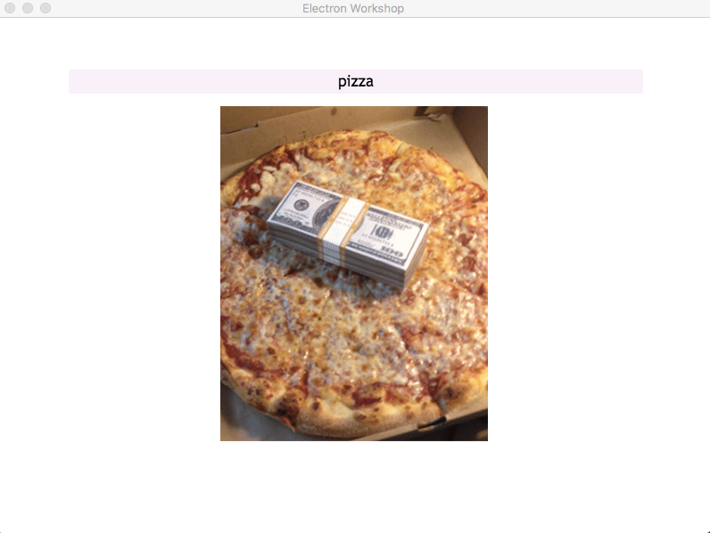
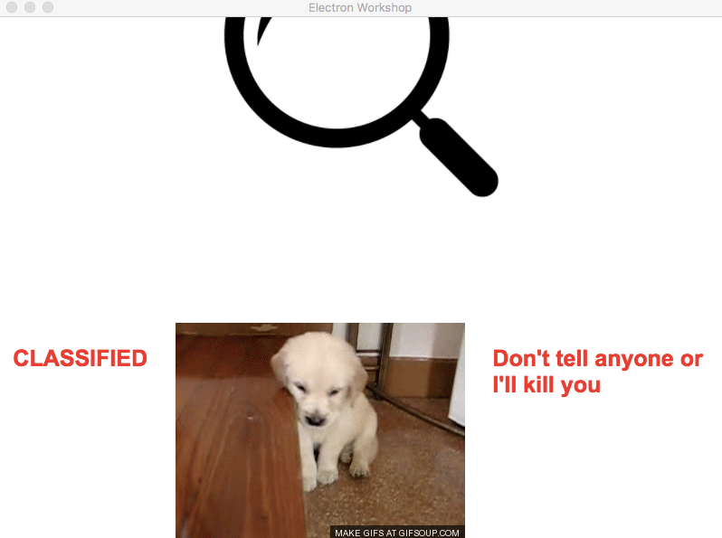

# Electron Workshop

**A quick way to see Electron in action.**

We are going to build a minimal Electron application based on the [Quick Start Guide](http://electron.atom.io/docs/tutorial/quick-start) within the Electron documentation.

**Use this app along with the [Electron API Demos](http://electron.atom.io/#get-started) app for API code examples to help you get started.**

You can learn more about each of these components within the [Quick Start Guide](http://electron.atom.io/docs/tutorial/quick-start).

Let's get down to business.

## Overview

We're going to create a small desktop app that returns a GIF based on a keyword. Then we're going to bind some keyboard shortcuts to do a variety of things, including closing the window, creating a new window, and changing the HTML/css of our contents.

An Electron app has the following basic file structure:

	|-Your Folder
		|---index.html
		|---main.js
		|---package.json
		|---node_modules
		|------blah blah blah


To run, a basic Electron application needs just these three files:

- `package.json` - Points to the app's main file and lists its details and dependencies.
- `main.js` - Starts the app and creates a browser window to render HTML. This is the app's **main process**.
- `index.html` - A web page to render. This is the app's **renderer process**.  

## To Use

To get started, fork this repo and install electron client tools using `npm install`:

```bash
npm install electron-cli electron -g
```

```bash
# Go into the repository
cd electron_presentation
# Install dependencies
npm install
# Run the app
npm start
```

Step 1: Basics
----
First, in `main.js` **comment out** the line that reads

```javascript
win.webContents.openDevTools()
```

because we don't want to see the dev tools when we start the app.
And in the callback function for `app.on('window-all-closed')`, change what's in there to `app.quit()` only, this will terminate the app once all windows are closed, instead of have the icon lingering in the dock, like Atom.

What we're trying to make is a Giphy search app that has a search bar and a display block. To accomplish that, we will first replace the content of `<body>` of `index.html` with

```html
<div id="main-container">
  <textarea id="search" placeholder="Search Keywork"></textarea>
  <div>
    
  </div>
</div>
```

Oh and don't forget to include the supplied styling file in `index.html`, took me a while to notice. Add this line to `<head>` in `index.html`

```html
<link rel="stylesheet" type="text/css" href="style.css">
```


And if there are other decorations you'd like to add, charge ahead.

Step 2: Functionalities
----
But if you have noticed, this app doesn't really do much does it? So we'll have to add the business logic in `renderer.js`, you can call it otherwise in your own project. Now add the following lines to your `renderer.js`
```javascript
let axios = require('axios');

const apiUrl = (term) => {
    return `http://api.giphy.com/v1/gifs/search?q=${term}&api_key=dc6zaTOxFJmzC`;
};

let searchBar = document.getElementById('search');
searchBar.onkeypress = (e) => {
    if (e.keyCode === 13) {
        e.preventDefault();

        if (searchBar.value === "")
            return;

        // loading
        document.getElementById('img-show')
                .setAttribute('src', 'imgs/loading.gif');

        axios.get(apiUrl(searchBar.value), {})
            .then((res) => {
                document.getElementById('img-show')
                        .setAttribute('src', res.data.data[0].images.original.url);
            }).catch((err) => {
                document.getElementById('img-show')
                        .setAttribute('src', "imgs/error.png");
                console.log(err);
            });
    }
};
```
Again, include it in `index.html`, it's just like a web app! Except this time you would add
```html
<script>
    require('./renderer.js')
</script>
```
towards the end of `index.html` file, inside `<html>` and after `<body>`. 

Finally
```bash
npm install --save axios
```
And run `electron .` again, gifs now will be displayed when you press enter in the search bar, it's simple as that.



Step 3: Keyboard Shortcut
----
Now we're going to set up global keyboard shortcut in `main.js`. First we do this by importing global keyboard shortcut.

```javascript
const globalShortcut = electron.globalShortcut
```

Now go to `app.on('ready')`. Inside here, we want to set up a const `ret` to which we register a keyboard shortcut. This means that once the electron app is initialized, it assigns a function to whatever shortcut we give it. 
You would register a keyboard shortcut for ctrl/cmd + E as follows:

```javascript
globalShortcut.register('CommandOrControl+E', () => {
    app.quit()
})
```
Your app should now quit if you press ctrl/cmd + E. If you got that working, try binding a few shortcuts of your own. Also inside `app.on('ready')` try binding the following keyboard shortcuts to each of the other following in-built Electron functions:

Ctrl/cmd + H
```javascript
	app.hide()
```

Ctrl/cmd + S
```javascript
	app.show()
```

Ctrl/cmd + N
```javascript
	createWindow(true, true)
```

Ctrl/cmd + F
```javascript
	createWindow(false, false)
```

Awesome! You've bound your own keyboard shortcuts and you look great today.

Step 3.5: Keyboard Shortcut (Cont.)
----

The keyboard functions we've bound so far execute inbuilt Electron functions. What if we want our shortcuts to execute javascript that we have written ourselves, for example code that we have in renderer.js? That's what we're going to do now!

First, we're going to want to import ipc into our main.js. Ipc is an in-built electron package that allows the main.js file to communicate with other js files in our electron app. At the top of main.js initialize:

```javascript
const ipc = require('electron').ipcMain
```

Then in `index.html`, below the search bar and image, add a secret section

```html
<div id="secretSection" style="display: none">
  <p class="secret_text"> <b> CLASSIFIED  </b> </p>
  
  <p class="secret_text"> <b> Don't tell anyone or <br/> I'll kill you </b> </p>
</div>
```

Now we're going to register a new shortcut in our `app.on('ready')` file. Put in the following function:

```javascript
  globalShortcut.register('CommandOrControl+P', () => {
    mainWindow.webContents.send('showSurprise')
  });
```

What's going on here? Well, instead of executing a function, this keyboard shortcut seems to instead send the string `('showSurprise')` somewhere. In fact, it's going to send this string to our renderer.js file, so let's make sure that our renderer.js file can receive this string and act appropriately once it does. 


In order to make sure that our `renderer.js` which is actually run in our `index.html` can receive the prompts from our keyboard shortcut, at the top of `renderer.js`, we want to declare the `ipc` variable. 

```javascript
const ipc = require('electron').ipcRenderer
```

We can now write a function that runs every time our `renderer.js` receives the prompt from the keyboard shortcut. 

```javascript
ipc.on("showSurprise", (event, data) => {
    if (document.getElementById('secretSection').style.display == "none"){
        document.getElementById('secretSection').style.display = "flex";
	} else {
		document.getElementById('secretSection').style.display = "none";
	}
})
```

The `ipc.on(String)` is what allows our function to listen for ipc prompts in the form of Strings sent by main.js. 

Now try running Electron and pressing Ctrl/Cmd + P. You should see a change at the bottom of the window. Which is great, as you can now bind keyboard shortcuts that execute your very own javascript!



Step 3.7: Remote
Add to top of `renderer.js`
```javascript
const remote = require('electron').remote;
```

Add the following to top of body tag in `index.html`

```html
<button id= "min-btn">Minimize</button>
<button id= "max-btn">Maximize</button>
<button id= "close-btn">Close</button>
```

Add the following, adapted from [here](http://stackoverflow.com/questions/31171597/atom-electron-close-the-window-with-javascript), to the bottom of `renderer.js`

```javascript
document.getElementById("min-btn").addEventListener("click", function (e) {
    var win = remote.getCurrentWindow();
    win.minimize();
});

document.getElementById("max-btn").addEventListener("click", function (e) {
    var win = remote.getCurrentWindow();
    if (!win.isMaximized()) {
        win.maximize();
    } else {
        win.unmaximize();
    }
});

document.getElementById("close-btn").addEventListener("click", function (e) {
    var win = remote.getCurrentWindow();
    win.close();
});
```

Last step: Packaging
----

You've created a wonderful app, and you want to distribute it to other people, how do you do that? Simple

```bash
npm install -g electron-packager
electron-packager .
```

Look around, there's a new folder with your app in it!

Done! If you want to distribute for other platforms, you will need to add support for multiple architectures but those things are widely available on the net. e.g. [here](https://www.npmjs.com/package/electron-builder).
